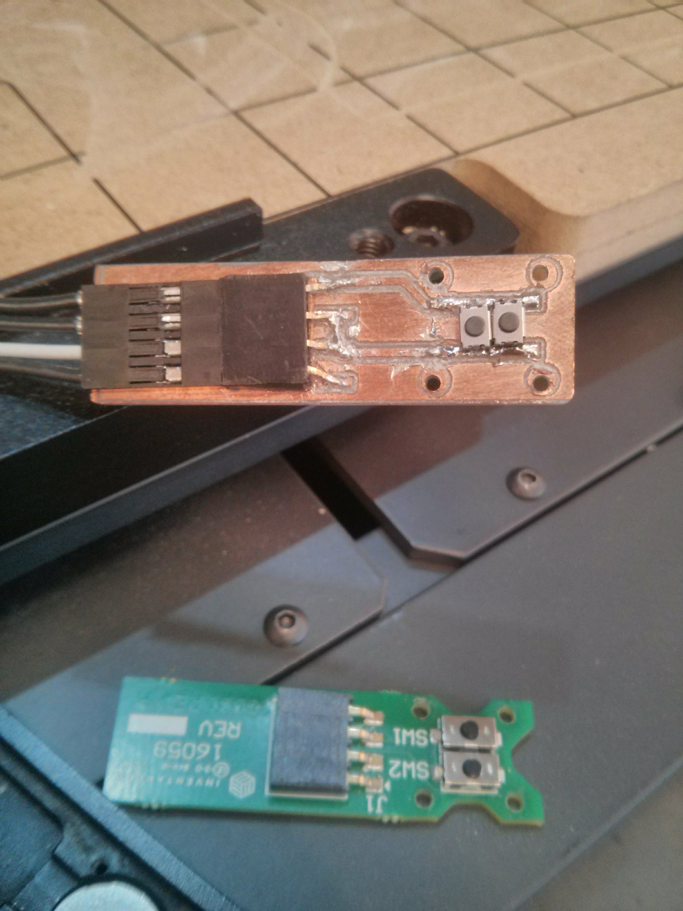
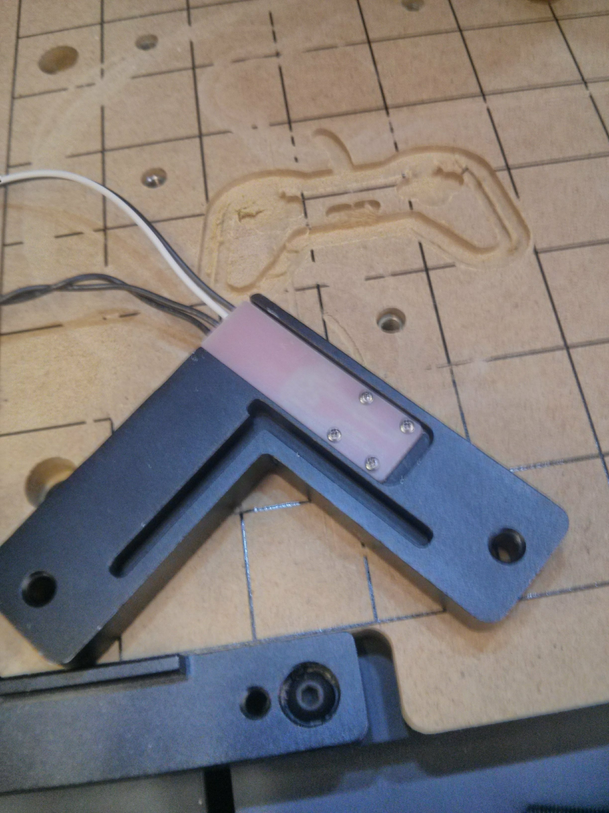
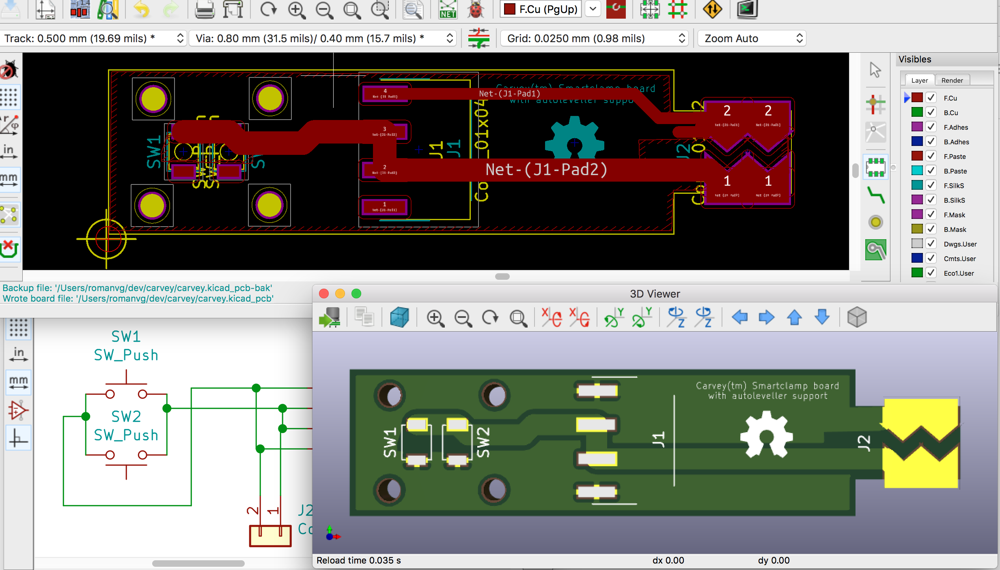

Carvey smartclamptm homebrew PCB enhancement with AutoLevelling support
=====

This is a working KiCad response to the [inventables thread on how to height probe a PCB](https://discuss.inventables.com/t/height-probing-a-pcb-on-carvey/21139/10) with [the Carvey](https://www.inventables.com/technologies/Carvey) and [Grbl Chillipeppr with autolevel plugin](http://chilipeppr.com/jpadie). Also a way to rapidly and inexpensively iterate on my PCB prototyping projects without long shipping times.

    
    

The new board has a convenient exposed zone outside the metallic clamp so that common alligator clips can be attached without long overhang wires as seen above in the pictures.

If there's enough interest in getting those boards made by a fab I can setup a tindie run perhaps? File an issue if so to gauge interest ;)
